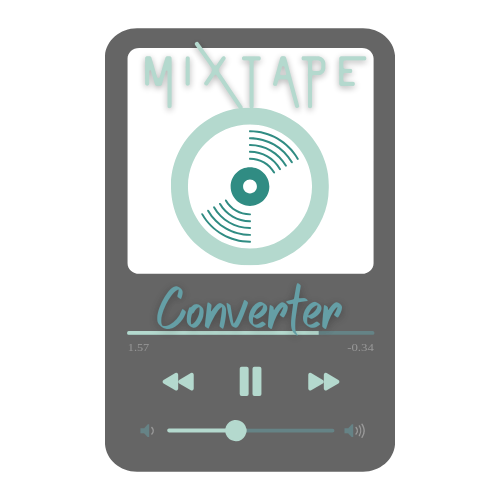

<div align="center">
  

  <h1>Mixtape Converter</h1>

  <p><strong>Wandle deine CD-Sammlung in Spotify-Playlists um – direkt im Browser, kein Server nötig.</strong></p>

  <p>
    <a href="https://github.com/w0rkingchr1s/MixtapeConverter/actions/workflows/deploy.yml">
      
    </a>
    <a href="https://github.com/w0rkingchr1s/MixtapeConverter/actions/workflows/ci.yml">
      
    </a>
    <a href="https://github.com/w0rkingchr1s/MixtapeConverter/blob/main/LICENSE">
      
    </a>
    <a href="https://github.com/w0rkingchr1s/MixtapeConverter/commits/main">
      
    </a>
    
    
    
  </p>

  <p>
    <a href="https://w0rkingchr1s.github.io/MixtapeConverter/">
      
    </a>
  </p>
</div>

---

## ✨ Features

| Feature | Beschreibung |
|---|---|
| 🎵 **Audio-Dateien** | Lade gerippte MP3/FLAC/WAV-Dateien hoch – ID3-Tags werden automatisch ausgelesen |
| ✍️ **Manuell** | Trackliste direkt eintippen oder als TXT-Datei hochladen |
| 📷 **OCR / Booklet** | Foto oder PDF-Scan eines CD-Booklets hochladen – Texterkennung läuft lokal im Browser |
| ✏️ **Tracks bearbeiten** | Vor dem Erstellen: Tracks editieren, löschen, hinzufügen und per Drag & Drop sortieren |
| 🎧 **Spotify-Playlist** | Direkte Erstellung per Spotify Web API – ohne Umweg über einen Server |
| 🔒 **Datenschutz** | Keine eigene Server-Infrastruktur – alles bleibt auf deinem Gerät |

---

## 🚀 So funktioniert es

```
Spotify Login  →  Eingabemethode wählen  →  Tracks bestätigen  →  Playlist erstellt ✓
```

### Flow 1 – 🎵 Audio-Dateien

> Ideal wenn du deine CD schon mit einem Tool wie *fre:ac*, *EAC* oder *iTunes* gerrippt hast.

1. CD mit einem beliebigen Ripper als MP3 / FLAC exportieren
2. Dateien in den Upload-Bereich ziehen
3. ID3-Tags werden automatisch ausgelesen (Künstler, Titel)
4. Trackliste prüfen & Playlist erstellen

```
📁 01 - Die Ärzte - Männer sind Schweine.mp3
📁 02 - Depeche Mode - Personal Jesus.mp3
   ↓  jsmediatags liest ID3-Tags
🎵  Die Ärzte - Männer sind Schweine
🎵  Depeche Mode - Personal Jesus
```

### Flow 2 – ✍️ Manuell

> Für handgeschriebene Setlists, Kassetten oder wenn ID3-Tags fehlen.

1. Tracks zeilenweise eintippen (`Künstler - Titel`)
2. **oder** eine fertige `.txt`-Datei hochladen
3. Trackliste bearbeiten & Playlist erstellen

### Flow 3 – 📷 OCR / Booklet-Scan

> Das Booklet aus der CD-Hülle abfotografieren – fertig.

1. Foto (JPG/PNG) oder PDF-Scan des Booklets hochladen
2. [Tesseract.js](https://tesseract.projectnaptha.com/) erkennt den Text **lokal im Browser** (keine Daten verlassen dein Gerät)
3. Parser extrahiert die Trackliste automatisch
4. Ergebnis prüfen & Playlist erstellen

> **Tipp:** Guter Kontrast und eine gerade Ausrichtung verbessern die Erkennungsqualität deutlich.

---

## 🛠️ Tech Stack

| Schicht | Technologie |
|---|---|
| **Frontend** | Vanilla JavaScript (ES2022), HTML5, CSS3 |
| **Auth** | [Spotify PKCE OAuth](https://developer.spotify.com/documentation/web-api/tutorials/code-pkce-flow) – kein Client Secret nötig |
| **Playlist-API** | [Spotify Web API](https://developer.spotify.com/documentation/web-api) |
| **OCR** | [Tesseract.js v5](https://github.com/naptha/tesseract.js) + [PDF.js](https://mozilla.github.io/pdf.js/) |
| **ID3-Tags** | [jsmediatags](https://github.com/aadsm/jsmediatags) |
| **Hosting** | GitHub Pages (statisch, kein Server) |
| **CI/CD** | GitHub Actions (ESLint · HTML-Validierung · Link-Check · Auto-Deploy) |

---

## ⚙️ Setup

### 1. Repository forken & GitHub Pages aktivieren

```
Repository → Settings → Pages
  Source: GitHub Actions
  → Save
```

Beim nächsten Push auf `main` deployt GitHub Actions die App automatisch.

### 2. Spotify Developer App konfigurieren

1. [developer.spotify.com/dashboard](https://developer.spotify.com/dashboard) öffnen
2. App auswählen (oder neu erstellen) → **Edit Settings**
3. **Redirect URIs** eintragen:

```
https://DEIN-USERNAME.github.io/MixtapeConverter/callback.html
```

Für lokale Entwicklung zusätzlich:

```
http://localhost:5500/callback.html
```

4. Speichern – fertig.

> Die `SPOTIFY_CLIENT_ID` ist bereits in `js/config.js` eingetragen.
> Möchtest du eine eigene App nutzen, einfach dort austauschen.

### 3. Lokal testen

Kein Build-Schritt nötig – einen Static-Server starten:

```bash
# Python (überall vorinstalliert)
python -m http.server 5500

# Node.js
npx serve .

# VS Code → "Live Server" Extension → "Open with Live Server"
```

App im Browser öffnen: **http://localhost:5500**

---

## 🧪 Code-Qualität & CI

### Abhängigkeiten installieren

```bash
npm install
```

### Checks ausführen

```bash
npm run lint              # ESLint – JavaScript prüfen
npm run lint:fix          # ESLint – automatisch korrigieren
npm run validate          # html-validate – alle HTML-Seiten
node scripts/check-links.js  # Interne Links auf Existenz prüfen
```

### CI-Pipeline (GitHub Actions)

Bei jedem Push und Pull Request laufen automatisch drei Jobs:

| Job | Tool | Prüft |
|---|---|---|
| **Lint JavaScript** | ESLint v9 | Code-Qualität, no-var, eqeqeq, … |
| **Validate HTML** | html-validate | Semantik, Attribut-Vollständigkeit |
| **Check internal links** | Eigenes Script | Alle `href`/`src`-Verweise auf Existenz |

---

## 📁 Projektstruktur

```
MixtapeConverter/
│
├── 📄 index.html          Startseite – Streaming-Dienst auswählen
├── 📄 callback.html       Spotify OAuth PKCE Callback
├── 📄 flow.html           Eingabemethode wählen
├── 📄 audio.html          Audio-Dateien hochladen + ID3-Tags lesen
├── 📄 manual.html         Manuell eingeben / TXT-Datei hochladen
├── 📄 ocr.html            Foto/PDF-Scan + OCR im Browser
├── 📄 confirm.html        Trackliste bearbeiten + Playlist erstellen
├── 📄 success.html        Ergebnis mit Link zur neuen Playlist
├── 📄 privacy.html        Datenschutzerklärung
│
├── 📁 css/
│   └── styles.css         Design (Teal/Türkis-Farbschema)
│
├── 📁 js/
│   ├── config.js          Spotify Client ID + Auto-Redirect-URI-Erkennung
│   ├── state.js           sessionStorage-Wrapper (kein Framework nötig)
│   ├── spotify.js         PKCE OAuth Flow + Spotify Web API Calls
│   ├── audio.js           ID3-Tag-Lesezugriff via jsmediatags
│   └── ocr.js             Tesseract.js + PDF.js Integration + Track-Parser
│
├── 📁 scripts/
│   └── check-links.js     CI-Script: prüft alle internen Links
│
├── 📁 .github/workflows/
│   ├── deploy.yml         Auto-Deploy → GitHub Pages (bei Push auf main)
│   └── ci.yml             ESLint + HTML-Validierung + Link-Check
│
├── 📁 static/             Logo & Assets
├── eslint.config.js       ESLint v9 Flat Config
├── .htmlvalidate.json     html-validate Regeln
├── package.json
└── SETUP.md               Kurzanleitung
```

---

## 🗺️ Roadmap

- [x] Spotify PKCE OAuth (kein Backend)
- [x] Flow: Audio-Dateien + ID3-Tags
- [x] Flow: Manuell / TXT-Upload
- [x] Flow: OCR (Tesseract.js, lokal im Browser)
- [x] Trackliste editierbar (inline, drag & drop, add/delete)
- [x] GitHub Actions CI/CD
- [x] Automatisches Deploy auf GitHub Pages
- [ ] Apple Music (MusicKit JS)
- [ ] Playlist-Cover aus CD-Booklet übernehmen
- [ ] Mehrsprachigkeit (DE / EN)

---

## 🤝 Contributing

Pull Requests sind willkommen! Für größere Änderungen bitte zuerst ein Issue öffnen.

```bash
git checkout -b feature/mein-feature
# … Änderungen machen …
npm run lint && npm run validate   # CI lokal vorab prüfen
git commit -m "feat: kurze Beschreibung"
git push origin feature/mein-feature
# → Pull Request auf GitHub öffnen
```

---

## 📄 Lizenz

[MIT](LICENSE) © 2024 W0rkingChr1s
